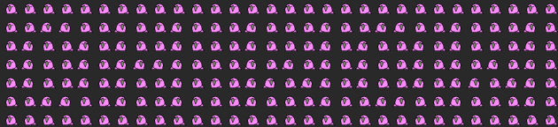

# Write-ASCIImoji
>
> -- Owen Wilson, probably

## Usage
```
Import-Module .\slackermost_ascii_art\Write-ASCIImoji.psm1

Write-ASCIImoji [-Text] <string> [-Foreground emoji1] [-Background emoji2]
```

## Example
```
Write-ASCIImoji -Text "OH WOW" -Foreground parrot -Background rightparrot
```